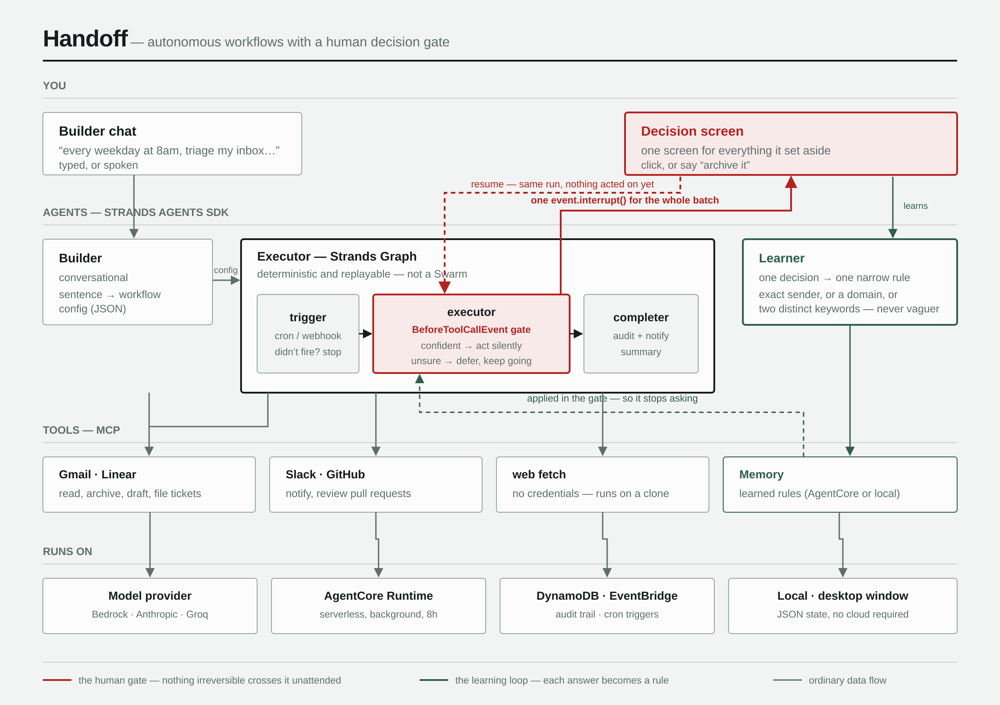

# Handoff

**Describe it. Hand it off. It runs.**

Handoff turns a sentence into an autonomous workflow — and then gets out of your
way. It runs on a schedule, handles what it can judge confidently, and stops to
ask you only about the things it genuinely can't call.

> Built on the [Strands Agents SDK](https://strandsagents.com) for the
> [Agents for Humans Hackathon](https://agentsforhumans.devpost.com/) —
> Professional Agents track.

```
Every weekday at 8am, triage my inbox. Real asks from teammates become
Linear tickets. Newsletters get archived. Mail from my manager gets a
draft reply. Anything you're not sure about, ask me.
```

That sentence becomes a workflow config, a cron trigger, and a running job. The
first morning it asks you about the few things it couldn't call — on one screen,
or out loud. By the second, it has stopped asking.



---

## The one thing to look at

The hackathon brief asks for an agent that *"runs autonomously and only surfaces
when there's a real decision to make."* That sentence is implemented in one
file: [`src/handoff/graph/hooks/hitl.py`](src/handoff/graph/hooks/hitl.py).

A `BeforeToolCallEvent` hook sits in front of the only tool that changes
anything in the outside world. Before each call it decides whether the agent has
earned the right to act alone:

```python
response = event.interrupt(
    interrupt_name,
    reason=payload.model_dump(mode="json"),
)
```

On the first pass that raises `InterruptException` and unwinds the agent loop —
**before the tool body runs**, so nothing has happened to your mail. When a
human answers, the same line *returns their answer* instead of raising, and the
tool carries out what they chose.

Unsure items are **deferred, not interrupted**: the executor finishes its pass,
then `finish_batch` raises a single interrupt carrying all of them. You get one
screen, not one interruption per question. The Graph state is serialised, so a
run paused at 08:04 and answered at 11:30 is the same run — it survives a
restart.

**What it is not:** an approval prompt on every action. On a real model, eight
messages: seven handled silently, one escalated. An agent that interrupts on
everything is just a worse inbox.

---

## See it run

**With nothing at all** — the whole loop on a scripted model, no keys, no
account:

```bash
git clone https://github.com/LSUDOKO/Handoff && cd Handoff
python3.12 -m venv .venv && source .venv/bin/activate
pip install -e ".[dev,groq,desktop,web]"
make demo
```

```
RUN 1 — it works the inbox on its own
  handled alone   5
  waiting on you  3

  ── Strategic partnership opportunity — time sensitive
     from partnerships@vendor.com
     30% sure of file_ticket
     Unknown external sender using urgency language. Could be a real business
     development lead or could be cold spam — I can't tell from one message,
     and filing or deleting both have a cost if I'm wrong.

YOU DECIDE — the three it couldn't call
  partnerships@vendor.com      → archive

RUN 2 — same inbox, and now it doesn't ask
  handled alone   5
  from your rules 3
  waiting on you  0
```

**With one free key** (Groq — real reasoning, and real voice):

```bash
cp .env.example .env       # set HANDOFF_MODEL_PROVIDER=groq and GROQ_API_KEY
make doctor                # every check makes a real API call
make desktop               # native window — or `make serve` for the browser
```

Press **Run now**. A live feed appears under the workflow — *fetched 8
messages… filed a ticket for… not sure about this one, setting it aside* — and
ends with what needs you. Turn **Voice on**, open a decision, hold the mic and
say *"archive it"*.

`HANDOFF_MODEL_PROVIDER` switches between `groq`, `anthropic` and `bedrock`. The
agent code is identical; only the model object differs. Bedrock is what the
AgentCore deployment uses. Full credential walkthrough:
[`docs/SETUP.md`](docs/SETUP.md).

---

## How it works

```
         "every weekday at 8am, triage my inbox…"
                          │
                          ▼
         ┌────────────────────────────────┐
         │  BUILDER AGENT                 │  picks the integrations, writes the
         │  conversational                │  cron trigger, and decides where the
         └────────────────┬───────────────┘  human line sits
                          │ workflow config (JSON)
                          ▼
   ┌──────────────────────────────────────────────────┐
   │  WORKFLOW EXECUTOR — a Strands Graph             │
   │                                                  │
   │   trigger ──▶ executor ──▶ completer             │
   │                  │                               │
   │                  └── HITL gate                   │
   │                       confident → act silently   │
   │                       unsure    → defer          │
   │                       end of pass → ask once     │
   └──────────────────────┬───────────────────────────┘
                          │ one screen, every decision
                          ▼
         ┌────────────────────────────────┐
         │  LEARNING AGENT                │  turns that decision into a rule, so
         │  post-decision                 │  the next run doesn't ask again
         └────────────────────────────────┘
```

### Three agents, because the jobs are different

| Agent | Does | Lives in |
|---|---|---|
| **Builder** | Turns a description into a workflow config you can read and version | [`agents/builder.py`](src/handoff/agents/builder.py) |
| **Executor** | Runs the workflow; decides what it may do alone | [`graph/factory.py`](src/handoff/graph/factory.py) |
| **Learner** | Turns each human decision into a narrow, reusable rule | [`agents/learner.py`](src/handoff/agents/learner.py) |

### Why `Graph` and not `Swarm`

A workflow is a fixed, auditable sequence: wake up, do the work, stop at
anything unclear, close out. `Graph` models exactly that — deterministic edges,
one entry point, a replayable execution order. `Swarm` models open-ended
collaboration between peers, which would make every run take a different path
through the same job. For something that files tickets in your name at 8am,
"different every time" is a bug, not a feature.

### Talk to it

Voice is real, not a browser trick: Groq **Whisper** transcribes what you say,
Groq **Orpheus** says things back, and the browser's own speech engines are the
fallback so nothing goes mute over a missing key. Spoken decisions — *archive
it, file a ticket, draft a reply, leave it* — are matched locally, with no model
round-trip. Turn **Voice on** in the header; decisions are read to you when they
open, and runs announce when they finish or set something aside.

### Watch it work

Every run streams what it's doing over server-sent events into a live feed on
the dashboard: what it fetched, what it did and how sure it was, what it set
aside and why. The audit log is the record; the feed is the window.

### Start from a template

Five workflows ship ready to run or adapt: morning inbox triage, weekly
competitor pricing watch (reads a live page through a credential-free MCP fetch
server), PR review triage, Slack channel digest, meeting follow-up.

### Learning that doesn't overreach

The Learning Agent's restraint matters more than its reach. A rule that fires
too eagerly takes actions nobody sanctioned, which is far worse than one extra
question. So `find_matching_preference` requires an exact sender match, a whole
domain, or **at least two distinct keyword hits** — one shared word is a
coincidence, not a rule. Most of the tests in
[`tests/test_learner.py`](tests/test_learner.py) are about rules *not* matching.

---

## Two front ends, one gate

| Surface | The gate's question goes to | Code |
|---|---|---|
| **Web / desktop** | A decision screen; the interrupt escapes and is answered out of band | [`web/server.py`](src/handoff/web/server.py), [`desktop.py`](src/handoff/desktop.py) |
| **Embedded in a host runtime** | The host's `request_human_input` channel; answered inline, the loop never unwinds | [`host/`](src/handoff/host/) |

Handoff can run inside another agent runtime that already holds the user's OAuth
tokens — then it uses *those* credentials rather than keeping a second copy, and
asks through the host's own prompt. The host protocol is two methods:

```python
from handoff.host import run_in_host

result = run_in_host(ctx, "run the morning triage")
# ctx.tools.list() / ctx.tools.call(name, args) — that's the whole contract
```

---

## Strands SDK surface used

| Feature | Where |
|---|---|
| `Agent` class | all three agents |
| `@tool` decorator | 14 custom tools |
| `BeforeToolCallEvent` hook | [`graph/hooks/hitl.py`](src/handoff/graph/hooks/hitl.py) |
| `event.interrupt()` / resume | the gate, and `WorkflowRunner.resume` |
| Batch interrupt | `finish_batch` — one question for a whole pass |
| `Graph` + `GraphBuilder` | [`graph/factory.py`](src/handoff/graph/factory.py) |
| Conditional edges | an empty webhook never costs a model invocation |
| `Graph.serialize_state` | a paused run survives a process restart |
| `MCPClient` (stdio + HTTP) | [`mcp/servers.py`](src/handoff/mcp/servers.py) |
| `AgentTool` subclass | [`host/tools.py`](src/handoff/host/tools.py) — host tools as Strands tools |
| `OpenAIModel` subclass | [`providers.py`](src/handoff/providers.py) — repairs malformed tool-call JSON |
| OpenTelemetry tracing | `config.configure_observability()` |

Built and verified against **`strands-agents` 1.55.1**, on a real model (Groq
`qwen/qwen3.8-27b`): 8 items, 7 handled alone, 1 escalated, one interrupt.

The interrupt API is version-sensitive — `event.interrupt(name, reason=…,
response=…)` returns the human's answer on resume rather than taking a `data=`
payload — so pin the version before changing anything in the gate.

---

## AWS deployment

| Service | Purpose |
|---|---|
| Amazon Bedrock (Claude Sonnet 4.5 / Nova) | reasoning for all three agents |
| AgentCore Runtime | serverless background execution, long-running invocations |
| AgentCore Memory | learned preferences across runs |
| AgentCore Browser | the competitor-pricing workflow |
| AgentCore Observability | OTEL traces → CloudWatch |
| DynamoDB | workflow configs, runs, interrupts, audit trail |
| EventBridge Scheduler | cron triggers |
| SNS | "a decision is waiting" notifications |

```bash
python infra/deploy_agentcore.py --check    # tells you exactly what's missing
python infra/deploy_agentcore.py            # build (arm64) → ECR → AgentCore
python infra/memory_setup.py                # AgentCore Memory store
python infra/dynamodb_setup.py              # durable storage
python infra/eventbridge_setup.py --list    # preview the schedules
```

Every store has a local JSON backend, so none of this is required to run, test
or demo the project — only to deploy it.

---

## Tests

```bash
make test
# 138 passed
```

The ones worth reading are in
[`tests/test_hitl_gate.py`](tests/test_hitl_gate.py), which drive the gate
inside a real Strands agent and assert the things that actually matter:

- an unsure call stops the loop **and the tool never runs**
- resuming executes what the human chose, not what the agent suggested
- choosing "leave it" cancels the tool rather than running it with a no-op
- a malformed confidence score fails toward asking, never toward acting

---

## Layout

```
src/handoff/
├── graph/hooks/hitl.py     ⭐ the interrupt gate
├── graph/factory.py        the Strands Graph
├── graph/nodes/            trigger, executor, classifier, gate, completer
├── agents/                 builder, executor runner, learner
├── host/                   embed Handoff in another agent runtime
├── web/                    FastAPI + HTMX — log, builder, decision, trace
├── workflows/              five shipped templates
├── memory/store.py         AgentCore Memory + local preferences
├── mcp/servers.py          MCP registry
├── tools/voice.py          Whisper in, Orpheus out, spoken commands
├── providers.py            resilient OpenAI-compatible provider
├── events.py               live run feed (SSE)
├── desktop.py              native window
├── doctor.py               real-call credential checks
└── app.py                  AgentCore Runtime entrypoint

docs/       ARCHITECTURE · SETUP · DEMO · SUBMISSION · diagram · plan/
infra/      AgentCore, DynamoDB, Memory, EventBridge
tests/      138 tests
```

---

## Licence

Apache-2.0. See [`LICENSE`](LICENSE) and [`NOTICE`](NOTICE).

All of it is original work built on the Strands Agents SDK. No third-party
source is vendored; every dependency is installed from its own distribution and
stays under its own licence.
